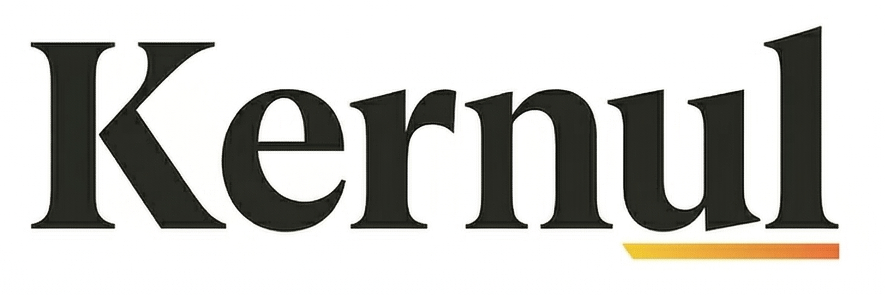

<!-- Logo -->

# KERNUL

**A modern operating system for people who care how things work.**

Clear. Open. Deterministic.  
Built from first principles with respect for the machine and the user.

---

<!-- Tech Stack Badges -->

---

## What is KERNUL?

KERNUL is a modern, open operating system designed for people who want **clarity instead of complexity**.

It is built with a simple idea:  
**the system should never hide what it’s doing or who is in control.**

No ambient privilege.  
No invisible behavior.  
No legacy baggage carried forward “just because.”

KERNUL is intentionally small, explicit, and understandable—so users, developers, and researchers can reason about the system with confidence.

---

## Why KERNUL?

Most operating systems grew by accumulation.  
KERNUL grows by **intent**.

- Authority is explicit, not assumed  
- Behavior is deterministic, not emergent  
- Architecture boundaries are real, not abstracted away  
- Failure paths are honest and terminal  

This makes KERNUL a strong foundation for learning, experimentation, and long‑term system design.

---

## Who is it for?

KERNUL is for:

- People who want to understand their computer, not negotiate with it  
- Developers who value correctness, clarity, and control  
- Researchers exploring operating system design without legacy constraints  
- Anyone curious about how modern systems *should* be built  

You don’t need to be an expert to explore KERNUL—but you’ll become one by doing so.

---

## Project Status

KERNUL is in **early development**.

The focus right now is on:
- clean architecture boundaries  
- deterministic behavior  
- correctness over features  

There is no rush. Every surface is intentional.

---

## Open by Design

KERNUL is free and open‑source software.

The entire system—design, code, and decisions—is developed in the open so it can be studied, audited, and improved by anyone who cares about how systems work.

---

**KERNUL**  
*A system that respects the machine—and the person using it.*

